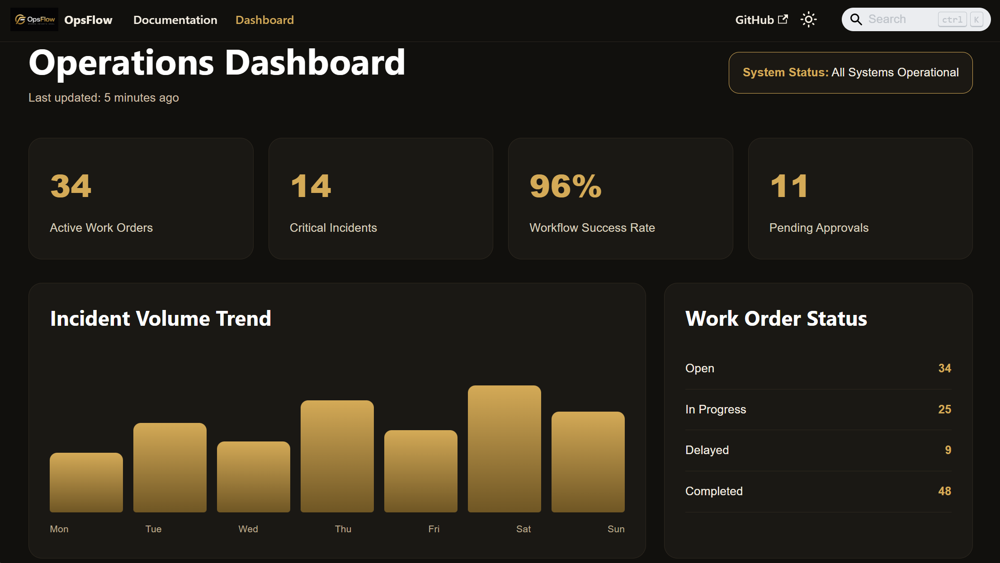

# OpsFlow SaaS Documentation Platform

Enterprise workforce operations documentation platform built with Docusaurus, TypeScript, React, and Mermaid workflow visualization.

🔗 Live Site: https://ops-flow-saa-s-documentation.vercel.app/

---

## Overview

OpsFlow is a fictional enterprise workforce operations platform created to demonstrate modern technical writing, SaaS documentation architecture, workflow visualization, API documentation, accessibility standards, and operational process communication.

The platform simulates a realistic enterprise documentation ecosystem supporting:

- Incident management
- Workflow automation
- Workforce scheduling
- Approval routing
- Role-based access control
- Multi-factor authentication
- Enterprise integrations
- REST API documentation
- Accessibility compliance guidance
- Operational reporting workflows

---

## Dashboard Preview



---

## Key Features

### Enterprise Documentation Architecture

- Structured multi-section documentation portal
- User onboarding and administrative guides
- Troubleshooting and FAQ documentation
- Release notes and changelog pages
- Integration documentation ecosystem

### Workflow Visualization

- Incident escalation workflows
- Approval routing diagrams
- MFA authentication workflows
- Work order lifecycle visualization
- Operational process documentation

### API Documentation

- REST API authentication
- Endpoint request and response examples
- Error handling references
- Rate limiting guidance
- Webhook integration examples

### Enterprise Integrations

- Slack integration
- Microsoft Teams integration
- Okta SSO configuration
- Jira synchronization
- ServiceNow workflows
- Webhook event subscriptions

### Dashboard Experience

- Operational monitoring dashboard
- System health indicators
- Activity feeds
- Notification center
- Workflow KPI tracking
- Interactive UI hover polish

---

## Technology Stack

| Technology | Purpose |
|---|---|
| Docusaurus | Documentation platform |
| TypeScript | Frontend development |
| React | Interactive UI components |
| Markdown | Documentation authoring |
| Mermaid | Workflow diagram visualization |
| CSS | UI styling and interaction polish |
| Vercel | Deployment and hosting |
| GitHub | Version control and repository hosting |

---

## Skills Demonstrated

- Technical writing
- Information architecture
- API documentation
- Workflow documentation
- SaaS documentation strategy
- Accessibility documentation
- Markdown authoring
- Docusaurus configuration
- Git/GitHub workflows
- Frontend UI polish
- Documentation UX design

---

## Local Development

### Install Dependencies

```bash
npm install
```

### Start Development Server

```bash
npm start -- --port 3003
```

### Production Build

```bash
npm run build
```

---

## Author

Brock Wilson

Technical Documentation & SaaS Documentation Portfolio Project
