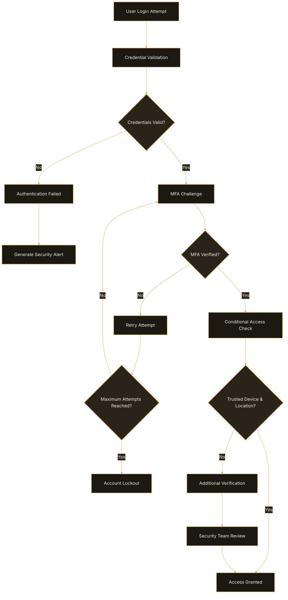

# MFA Configuration

Multi-factor authentication (MFA) provides additional account security
for privileged operations and administrative access.

## Supported MFA Methods

OpsFlow supports:

- authenticator applications
- SMS verification
- backup recovery codes

## Enable MFA

1. Open **Settings > Security**.
2. Select **Enable MFA**.
3. Scan the QR code using an authenticator application.
4. Enter the verification code.
5. Save changes.

## Best Practices

- Require MFA for administrators.
- Store recovery codes securely.
- Review MFA enrollment status regularly.

## Troubleshooting

### Invalid Verification Code

Verify that automatic device time synchronization is enabled.

## Multi-Factor Authentication Workflow

The following workflow demonstrates how OpsFlow validates user credentials, applies MFA policies, and enforces conditional access security controls.

## Related Articles

- Security Policies
- User Management
- Password Requirements