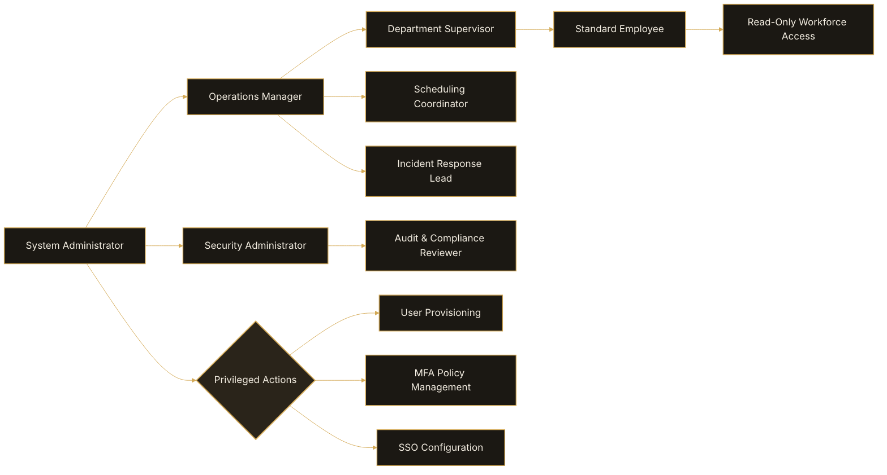

# User Management

Administrators can manage users, permissions, departments,
and account status from the User Management console.

## Open User Management

1. Open **Administration > Users**.
2. Search for a user account.
3. Select the user profile.

## Administrative Actions

Administrators can:

- reset passwords
- disable accounts
- assign roles
- configure departments
- manage MFA status
- review account activity

## Account Status Types

| Status | Description |
|---|---|
| Active | User can access OpsFlow |
| Suspended | Temporary access restriction |
| Disabled | User account fully disabled |

## Best Practices

- Disable inactive accounts immediately.
- Review permissions quarterly.
- Enforce MFA for privileged users.

## Role-Based Access Control Hierarchy

The following diagram illustrates how OpsFlow assigns permissions and operational access across administrative and workforce roles.

## Related Articles

- Roles Overview
- MFA Configuration
- Security Policies