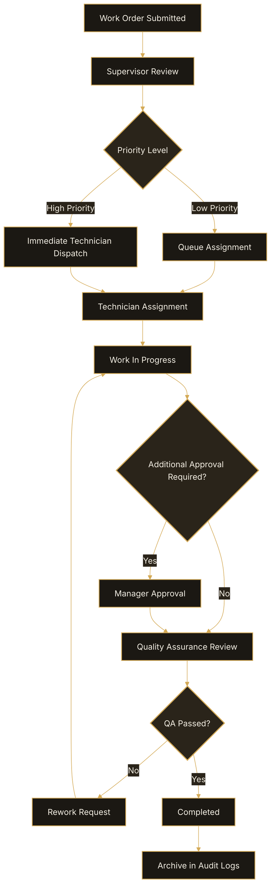

# Create Work Orders

Work orders are used to track operational tasks, maintenance requests,
and department activities within OpsFlow.

## Before You Begin

You must have:

- Employee permissions or higher
- Access to the Work Orders module

## Create a Work Order

1. Open **Operations > Work Orders**.
2. Select **New Work Order**.
3. Enter a work order title.
4. Select a department.
5. Assign a priority level.
6. Add supporting notes or attachments.
7. Select **Submit Work Order**.

## Priority Levels

| Priority | Description |
|---|---|
| Low | Non-urgent operational tasks |
| Medium | Standard operational work |
| High | Time-sensitive operational issues |
| Critical | Immediate operational disruption |

## Expected Result

After submission, the work order is routed to the assigned supervisor for review.

## Troubleshooting

### Unable to Submit Work Order

Verify that all required fields are completed before submitting.

### Missing Department Options

Department visibility is controlled by administrator permissions.

## Work Order Lifecycle Workflow

The following workflow illustrates how OpsFlow routes work orders from initial submission through approval, assignment, resolution, and archival.

## Related Articles

- Incident Reporting
- Workflow Automation
- Supervisor Permissions