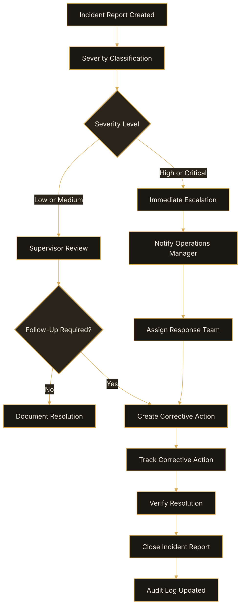

# Incident Reporting

Incident reports are used to document safety issues, operational disruptions,
equipment failures, and workplace events.

## Report an Incident

1. Open **Safety > Incident Reports**.
2. Select **Create Incident Report**.
3. Enter incident details.
4. Select severity level.
5. Attach supporting documentation if applicable.
6. Submit the report.

## Severity Levels

| Severity | Description |
|---|---|
| Low | Minor operational issue |
| Medium | Operational disruption |
| High | Significant operational impact |
| Critical | Immediate safety or operational risk |

## Escalation Workflow

Critical incidents automatically:

- notify supervisors
- trigger escalation workflows
- create audit log entries

## Expected Result

Incident reports become visible within the Incident Management dashboard.

## Incident Escalation Workflow

The following workflow shows how OpsFlow routes incident reports based on severity, supervisor review, and corrective action requirements.

## Related Articles

- Workflow Automation
- Audit Logs
- Reporting & Analytics