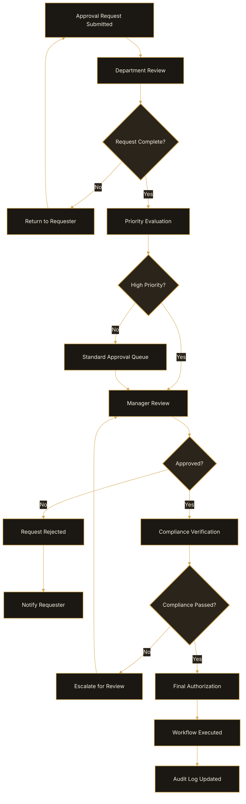

# Approval Workflows

Approval workflows automate review and authorization processes
for operational activities.

## Configure Approval Workflow

1. Open **Automation > Approval Workflows**.
2. Select **Create Workflow**.
3. Enter workflow name.
4. Configure trigger conditions.
5. Assign approval stages.
6. Save the workflow.

## Supported Approval Scenarios

Approval workflows support:

- overtime approvals
- work order approvals
- maintenance requests
- department requests
- operational escalations

## Best Practices

- Limit unnecessary approval stages.
- Configure escalation timeouts.
- Review workflow performance regularly.

## Approval Workflow Diagram

The following workflow shows how OpsFlow routes approval requests based on department review, priority level, compliance checks, and final authorization.

## Related Articles

- Automation Overview
- Escalation Rules
- Notifications & Alerts